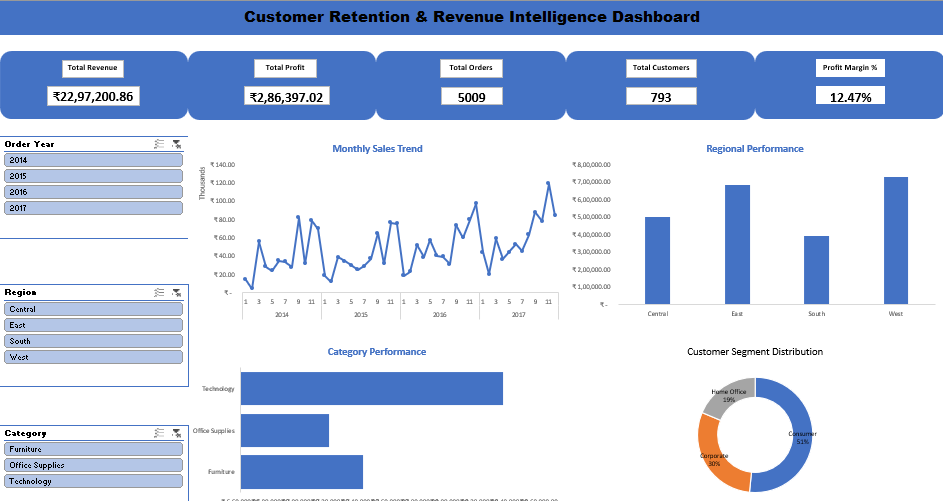
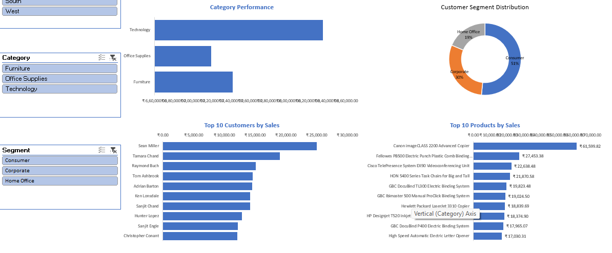
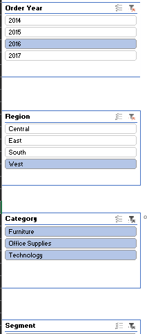
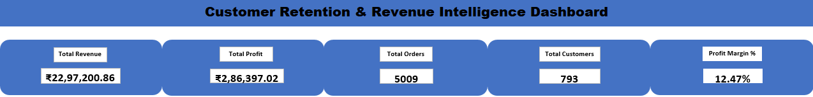

# 📊 Customer Retention & Revenue Intelligence Platform

> An End-to-End Data Analytics Project built using **Python, MySQL, Microsoft Excel, and GitHub** to analyze customer behavior, sales performance, and business profitability through data-driven insights and an interactive dashboard.

---

## 📌 Project Overview

Businesses generate large amounts of sales and customer data every day, but raw data alone cannot support strategic decision-making.

This project transforms raw retail sales data into meaningful business insights by performing:

- Data Cleaning & Feature Engineering
- Exploratory Data Analysis (EDA)
- SQL-based Business Analysis
- Interactive Excel Dashboard Development

The project demonstrates a complete Data Analytics workflow, from data preparation to executive-level reporting.

---

## 🎯 Business Objectives

- Analyze overall sales and profitability.
- Identify high-performing products and categories.
- Understand customer purchasing behavior.
- Evaluate regional business performance.
- Track monthly sales trends.
- Provide actionable business recommendations using data.

---

## 🛠️ Tech Stack

| Tool | Purpose |
|------|---------|
| Python | Data Cleaning, Feature Engineering & EDA |
| Pandas | Data Manipulation |
| NumPy | Numerical Operations |
| Matplotlib | Data Visualization |
| Seaborn | Statistical Visualization |
| MySQL | Business Analysis using SQL |
| Microsoft Excel | Interactive Dashboard |
| Git & GitHub | Version Control & Portfolio |

---

# 📂 Project Structure

```text
Customer-Retention-Revenue-Intelligence-Platform
│
├── data
│   ├── Superstore.csv
│   └── Superstore_Cleaned.csv
│
├── python
│   ├── 01_data_cleaning.py
│   ├── 02_feature_engineering.py
│   ├── 03_eda.py
│   └── requirements.txt
│
├── sql
│   ├── 01_business_overview.sql
│   ├── 02_sales_analysis.sql
│   ├── 03_customer_analysis.sql
│   ├── 04_product_analysis.sql
│   ├── 05_profit_analysis.sql
│   ├── 06_time_analysis.sql
│   ├── 07_advanced_analysis.sql
│   └── 08_business_recommendations.sql
│
├── excel
│   └── Customer_Retention_Revenue_Intelligence_Dashboard.xlsx
│
├── images
│   ├── Dashboard_1.png
│   ├── Dashboard_2.png
│   ├── Dashboard_Filters.png
│   └── Dashboard_KPIs.png
│
└── README.md
```

---

# 📊 Dashboard Preview

### Executive Dashboard




### Dashboard with Filters



### KPI Cards




---

# 📈 Key Performance Indicators (KPIs)

| KPI | Value |
|------|-------:|
| Total Revenue | ₹22,97,200.86 |
| Total Profit | ₹2,86,397.02 |
| Total Orders | 5,009 |
| Total Customers | 793 |
| Profit Margin | 12.47% |

---

# 📉 SQL Business Analysis

The SQL analysis covers:

- Business Overview
- Sales Performance Analysis
- Customer Analysis
- Product Analysis
- Profit Analysis
- Time Series Analysis
- Advanced SQL Analysis
- Business Recommendations

SQL concepts used:

- Aggregate Functions
- GROUP BY
- HAVING
- CASE Statements
- Common Table Expressions (CTEs)
- Window Functions
- Ranking Functions
- Date Functions
- Joins
- Subqueries

---

# 🐍 Python Workflow

### Data Cleaning

- Removed duplicate records
- Checked missing values
- Corrected data types
- Standardized columns

### Feature Engineering

Created additional business columns:

- Order Year
- Order Month
- Month Name
- Quarter
- Shipping Days
- Profit Margin (%)

### Exploratory Data Analysis

Performed analysis on:

- Sales
- Profit
- Region
- Category
- Customer Segment
- Monthly Trends

Generated business insights using visualizations.

---

# 📊 Excel Dashboard Features

Interactive Dashboard includes:

- Executive KPI Cards
- Monthly Sales Trend
- Regional Performance
- Category Performance
- Customer Segment Distribution
- Top 10 Customers
- Top 10 Products
- Interactive Slicers

---

# 💡 Key Business Insights

- Consumer segment contributes the highest share of orders.
- Technology products generate the highest revenue.
- Sales show clear monthly fluctuations.
- Some regions outperform others in profitability.
- A small group of customers contributes significantly to total revenue.
- Product-level analysis helps identify top-performing products.

---

# 🚀 How to Run

1. Clone the repository

```bash
git clone https://github.com/mohd-zaid11/Customer-Retention-Revenue-Intelligence-Platform.git
```

2. Install Python dependencies

```bash
pip install -r requirements.txt
```

3. Open SQL scripts in MySQL Workbench.

4. Open the Excel dashboard.

---

# 📚 Skills Demonstrated

- Data Cleaning
- Feature Engineering
- Exploratory Data Analysis
- SQL Query Writing
- Business Analytics
- Dashboard Design
- Data Visualization
- Git & GitHub

---

# 🔮 Future Improvements

- Power BI Dashboard
- Customer Lifetime Value Analysis
- Sales Forecasting
- Customer Segmentation
- Automated Reporting

---

# 👨‍💻 Author

**Mohd Zaid Bin Haneef**

Aspiring Data Analyst | Python | SQL | Excel | Data Visualization

---

## ⭐ If you found this project useful, consider giving it a Star.